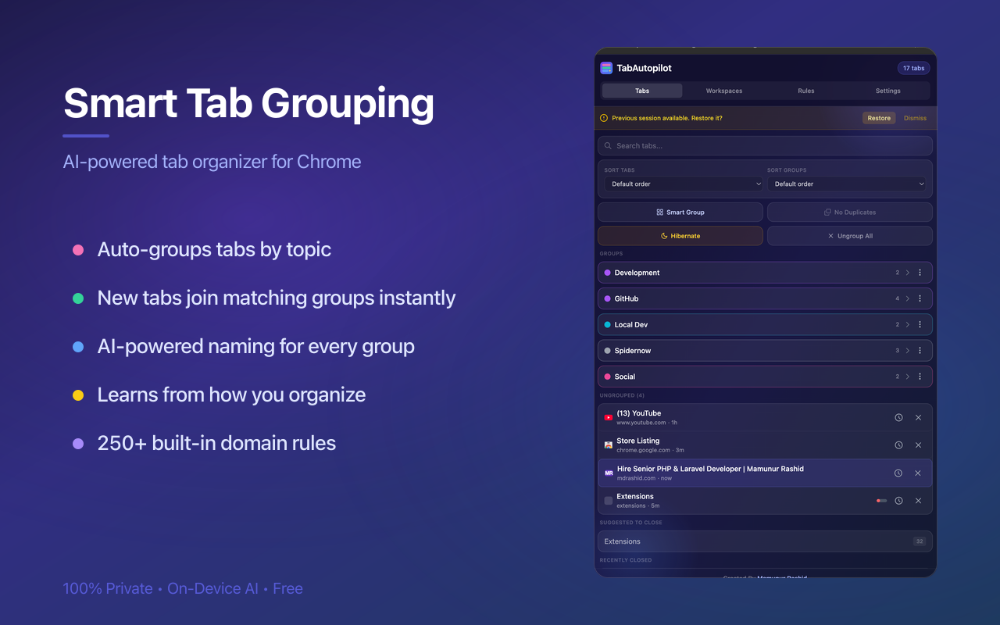
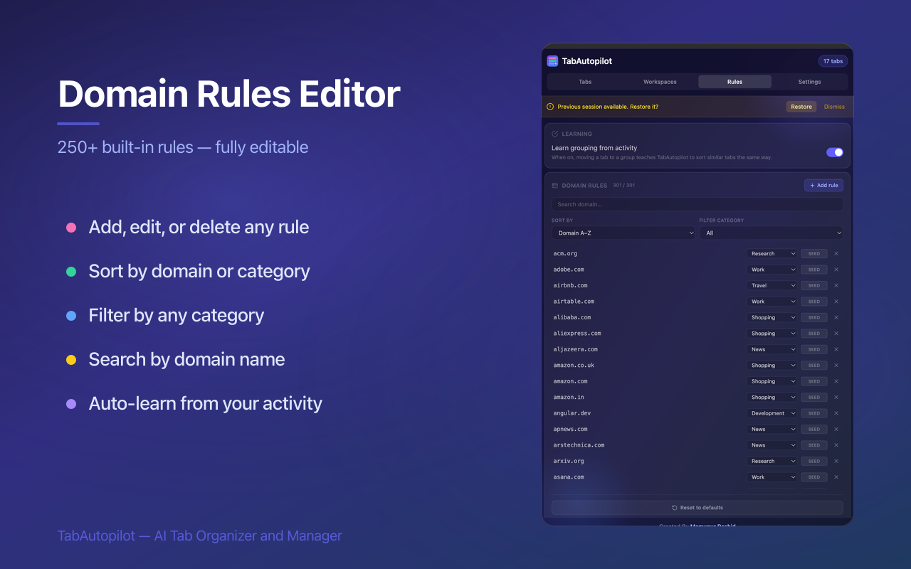
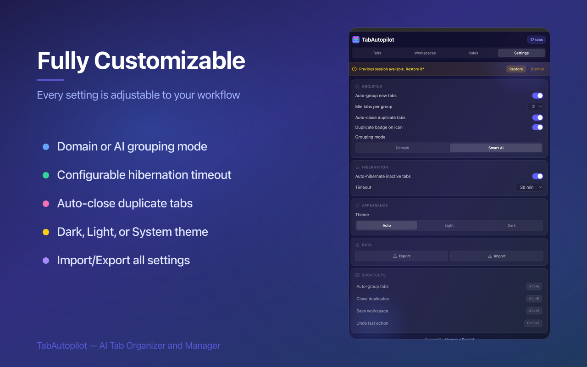
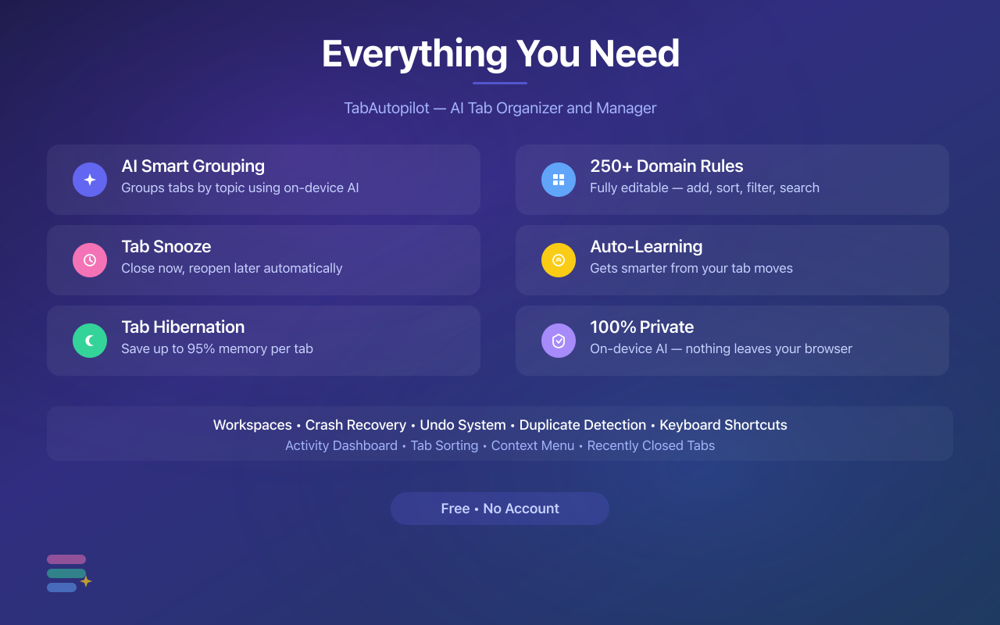

# TabAutopilot

### AI Smart Tab Manager & Tab Organizer for Chrome

The smart tab manager that organizes itself — auto-groups tabs by topic with on-device AI, 
snoozes tabs for later, hibernates inactive tabs, closes duplicates, and restores sessions. 
**Zero data leaves your browser.**

 

 

  

`Smart Grouping` · `Tab Snooze` · `Hibernation` · `250+ Rules` · `Auto-Learning` · `Workspaces` · `Free`

---

## Install

**[Add TabAutopilot to Chrome — free on the Chrome Web Store](https://chromewebstore.google.com/detail/nplekjmldglpfcdiechmgahoefhfheom)**

Requires **Chrome 120+**. AI features require **Chrome 127+** (falls back to rule-based grouping on older versions).

---

## 🛠️ More tools by the same maker

<table>
<tr>
<td width="150" align="center" valign="middle">

</td>
<td valign="middle">

### 🚀 Try LiveMetrics &nbsp;·&nbsp; Network & system monitor for Mac

**Chrome eating your RAM isn't the only thing worth watching.** A free macOS menu bar app showing live upload and download speed every second — read from your Mac's own interface counters, so the numbers reflect what's actually moving. CPU, GPU, RAM and temperature by default too.

  

</td>
</tr>
</table>

<table>
<tr>
<td width="150" align="center" valign="middle">

</td>
<td valign="middle">

### 📦 Try NPM Manager &nbsp;·&nbsp; Visual npm packages for VS Code

**Never memorize an npm command again.** A free VS Code extension that puts every package behind a clean visual interface — run scripts, install, update, and remove packages, and manage all your project dependencies without ever leaving the editor or touching the terminal.

  

</td>
</tr>
</table>

---

## Why another Chrome tab manager?

Most tab manager extensions group tabs by domain or make you drag everything by hand. TabAutopilot understands what each tab is actually about by reading the page title, not just the URL. A localhost page called "Investment Dashboard" goes into an Investment group, not a Dev group. Open a new Instagram tab while a Social group already exists with Twitter and Reddit — Instagram joins it instantly. And it **learns from you** — move a tab to a different group once and it remembers your preference forever.

No account. No server. No tracking. All AI runs on your device via Chrome's built-in Gemini Nano.

---

## Features at a glance

| Feature                     | What it does                                                         |
| --------------------------- | -------------------------------------------------------------------- |
| **AI Tab Grouping**         | Auto-groups tabs by topic using on-device AI — not just by domain    |
| **Instant Tab Joining**     | New tabs snap into matching tab groups automatically, no waiting     |
| **Domain Rules Editor**     | 250+ built-in rules you can add to, edit, filter, sort, or reset     |
| **Auto-Learning (opt-in)**  | Learns from your manual moves and gets smarter over time             |
| **Tab Snooze**              | Close a tab now, it reopens automatically later                      |
| **Tab Hibernation**         | Suspends inactive tabs to cut Chrome memory usage by up to 95%       |
| **Duplicate Tab Closer**    | Finds and closes duplicate tabs in one click                         |
| **Session Manager**         | Save, restore, and switch workspaces; crash recovery built in        |
| **Glass UI**                | Modern glassmorphism design with frosted cards and ambient glow      |
| **100% Private**            | Everything runs on your device. Zero data leaves your browser        |

---

## Auto group tabs by topic (AI tab grouping)

- **Smart Group** — one click to auto-group all open tabs by topic using AI
- **AI-powered naming** — tab groups get meaningful names like "Vue Dev" instead of "github"
- **Domain-based mode** — group tabs by website with clean names (GitHub, YouTube, Translate, Docs, etc.)
- **Context-aware** — understands tab titles to pick the right group, not just the domain
- **Instant joining** — open a new tab and it joins the matching existing tab group automatically
- **No duplicate groups** — if a group already exists, new tabs merge into it
- **Auto-group on new tabs** — optional setting to organize tabs as you browse
- **Friendly names for 45+ sites** — Google Translate shows as "Translate", not "translate.google"

---

## Domain rules — control how tabs are grouped

- **250+ built-in rules** — curated domain-to-category mappings covering Development, Social, Work, Shopping, News, Entertainment, Finance, Education, Research, Reference, Travel, and Health
- **Editable from the sidepanel** — add, edit, or delete any rule from the Rules tab
- **Sort** by domain (A–Z / Z–A) or category (A–Z / Z–A)
- **Filter** the table by any single category
- **Search** by domain name
- **Source badges** — each rule is tagged `seed`, `user`, or `learned` so you can see where it came from
- **Reset to defaults** — wipe user and learned rules, keep only built-in rules

---

## A tab manager that learns from you

- **Opt-in toggle** — off by default. Flip "Learn grouping from activity" in the Rules tab to enable
- **Learns from you** — drag a tab to a different group and the extension remembers your preference
- **Immediate effect** — other tabs on the same domain benefit right away
- **Your moves always win** — manual corrections override everything else
- **Gets smarter over time** — the more you use it, the better it gets
- **Domain-level learning** — correct one Reddit tab and all Reddit tabs follow

---

## Snooze tabs for later

- **Snooze any tab** — click the clock icon on any tab to snooze it
- **Preset times** — In 1 hour, In 3 hours, Next Monday
- **Custom time** — pick any date and time with the datetime picker
- **Snooze entire groups** — snooze all tabs in a tab group at once
- **Snoozed list** — see all snoozed tabs and groups at the bottom of the Tabs section
- **Restore early** — bring back any snoozed tab before the timer fires
- **Cancel snooze** — remove from snoozed list without reopening
- **Group preservation** — snoozed groups reopen as a group with original name and color
- **Survives restart** — snoozed tabs reopen on schedule even after browser restart

---

## Tab suspender — hibernate inactive tabs, save memory

Each Chrome tab eats 50–300 MB of RAM. TabAutopilot works as a modern tab suspender for Manifest V3 — a safe replacement for The Great Suspender.

- **Auto-hibernate** — inactive tabs suspended after a configurable timeout (15 min–2 hr)
- **Manual hibernate** — hibernate all inactive tabs with one click
- **Safe** — pinned tabs and tabs playing audio are never hibernated
- **Instant reload** — hibernated tabs stay in the tab bar and reload on click
- **Memory saver** — up to 95% memory reduction per hibernated tab, freeing GBs of RAM

---

## Close duplicate tabs automatically

- **Badge count** — extension icon shows how many duplicate tabs you have
- **One-click close** — close all duplicate tabs instantly
- **Smart matching** — recognizes true duplicates even when URLs have different tracking parameters
- **Auto-close** — optionally close duplicates the moment they open

---

## Session manager — workspaces & crash recovery

- **Save workspace** — snapshot all current tabs and tab groups with a name
- **Restore workspace** — reopen a saved workspace in a new window
- **Switch workspace** — save current state, close tabs, restore another
- **Full group preservation** — tab group names, colors, and collapsed state are saved and restored
- **Unlimited workspaces** — completely free, no account
- **Auto-save** — session saved every 5 minutes and on every tab change
- **Crash recovery** — if Chrome closes unexpectedly, restore every tab and group with one click

---

## Settings

- **Auto-group toggle** — enable/disable automatic grouping on tab creation
- **Min tabs per group** — set minimum (2, 3, 4, or 5)
- **Auto-close duplicate tabs** — close duplicates as they appear
- **Duplicate badge** — show/hide duplicate count on extension icon
- **Grouping mode** — choose Domain-based or Smart AI
- **Hibernation timeout** — 15 minutes to 2 hours
- **Theme** — system, light, or dark mode with glassmorphism UI
- **Import/Export** — backup and restore all settings as JSON
- **Learn from activity** — opt-in toggle in the Rules tab

---

## Everything at a glance

---

## More features

### Activity dashboard

Located in the Workspaces view.

- **Memory stats** — see hibernated tab count and estimated memory saved (MB/GB)
- **30-day history chart** — daily memory savings visualized as a bar chart
- **Top domains** — bar chart of your most-visited domains by tab count
- **Category breakdown** — colored pills showing tab distribution (Development, Work, Social, etc.)
- **Quick stats** — open tabs, unique domains, average activity score at a glance
- **Activity levels** — bar chart showing High/Medium/Low/Idle tab distribution

### Tab search & sorting

- **Age indicator** — every tab shows how long it's been open (2h, 3d, 5m)
- **Activity score** — visual bar showing how active each tab is (green/yellow/red)
- **Sort tabs** — by title, domain, activity score, or default browser order
- **Sort groups** — by name, tab count, or default order
- **Search tabs** — find any tab instantly by title or URL with match count

### Recently closed

- **Last 8 tabs** — see recently closed tabs at the bottom of the panel
- **One-click restore** — reopen any recently closed tab instantly

### Undo

- **Undo everything** — last 10 actions are undoable (close, group, ungroup, hibernate)
- **Keyboard shortcut** — `Cmd+Z` / `Ctrl+Z` works in the side panel
- **Undo toast** — notification with undo option after every destructive action

### Keyboard shortcuts

| Shortcut     | Action                   |
| ------------ | ------------------------ |
| `Alt+G`      | Auto-group all tabs      |
| `Alt+D`      | Close all duplicate tabs |
| `Alt+S`      | Save current workspace   |
| `Cmd/Ctrl+Z` | Undo last action         |

### Context menu

Right-click any page for quick actions:

- Move current tab to a new group
- Save current group as a workspace
- Hibernate the current group
- Close duplicates of the current tab

### Glass UI

- **Frosted glass cards** — semi-transparent panels with backdrop blur
- **Gradient backgrounds** — deep indigo gradient in dark mode, soft blue in light
- **Ambient glow** — subtle gradient orbs for depth
- **Smooth transitions** — polished animations across all interactions

---

## TabAutopilot vs other tab managers

| | TabAutopilot | OneTab | Workona | Toby | Session Buddy |
|---|---|---|---|---|---|
| Auto-group tabs by topic (AI) | ✅ | ❌ | ❌ | ❌ | ❌ |
| Native Chrome tab groups | ✅ | ❌ flat list | ❌ own UI | ❌ own UI | ❌ |
| Learns from your corrections | ✅ | ❌ | ❌ | ❌ | ❌ |
| Tab snooze | ✅ | ❌ | ❌ | ❌ | ❌ |
| Tab suspender / hibernation | ✅ | ❌ | ✅ | ❌ | ❌ |
| Duplicate tab closer | ✅ | ✅ | ❌ | ❌ | ❌ |
| Session manager / workspaces | ✅ unlimited | partial | ⚠️ 5 free | ✅ | ✅ |
| Crash recovery | ✅ | ❌ | ✅ | ❌ | ✅ |
| Works without an account | ✅ | ✅ | ❌ | ❌ | ✅ |
| On-device AI (no cloud) | ✅ | — | — | — | — |
| Free, all features | ✅ | ✅ | ❌ | ❌ | ✅ |

- **OneTab alternative** — TabAutopilot keeps tabs in the tab bar as native Chrome tab groups instead of dumping them into a flat list
- **Workona free alternative** — unlimited workspaces, no account, no 5-workspace limit
- **Toby alternative** — grouping is automatic; no manual drag-and-drop
- **The Great Suspender replacement** — safe Manifest V3 tab suspender with no tracking
- **Session Buddy alternative** — adds snooze, hibernation, duplicate detection, and AI grouping on top of session management

---

## FAQ

**How do I automatically group tabs in Chrome?**
Install TabAutopilot and press `Alt+G` (or click "Smart Group" in the side panel). All open tabs are organized into named, colored Chrome tab groups by topic. Turn on auto-grouping and every new tab is sorted as you browse.

**Does TabAutopilot send my browsing data anywhere?**
No. Categorization runs entirely on your device — Chrome's built-in Gemini Nano handles the AI, and a local rule engine covers everything else. The extension makes zero network calls with your data. There is no account, no analytics, and no tracking.

**Does it work without AI?**
Yes. On Chrome versions without Gemini Nano (or unsupported hardware), TabAutopilot falls back to its rule-based engine with 250+ domain rules — grouping still works out of the box.

**How does the tab suspender differ from Chrome's Memory Saver?**
Chrome's Memory Saver decides for you. TabAutopilot lets you set the timeout (15 min–2 hr), never touches pinned or audio-playing tabs, shows how much memory you saved, and pairs hibernation with grouping, snooze, and sessions.

**Can I recover tabs after Chrome crashes?**
Yes. Your session (tabs + groups + colors + collapsed state) is auto-saved every 5 minutes and on every tab change. After a crash, one click restores everything.

**Is TabAutopilot free?**
Yes — every feature, unlimited workspaces, no premium tier, no account.

---

## Privacy

- **No account required** — works out of the box
- **No data collection** — we don't track anything
- **No external API calls** — nothing leaves your browser
- **On-device AI** — all processing runs locally on your machine
- **Local storage only** — all data stays on your device
- **Free** — free to use with all features included

---

## Feedback & issues

Found a bug? Have a feature request?

**[Open an issue](https://github.com/rocke3/TabAutopilot/issues)**

Please include:

- Chrome version (`chrome://version`)
- Steps to reproduce the problem
- Screenshot if applicable

---

## License

This extension is free to use. All rights reserved.

See [LICENSE](LICENSE) for details.

---

## Author

**Mamunur Rashid** — Senior Software Engineer with 10+ years of experience in web development, specializing in dynamic CMS-based and custom web applications.

[Website](https://mdrashid.com) · [GitHub](https://github.com/rocke3) · [LinkedIn](https://linkedin.com/in/rfmamun) · [Fiverr](https://fiverr.com/mamunurrashi461)
